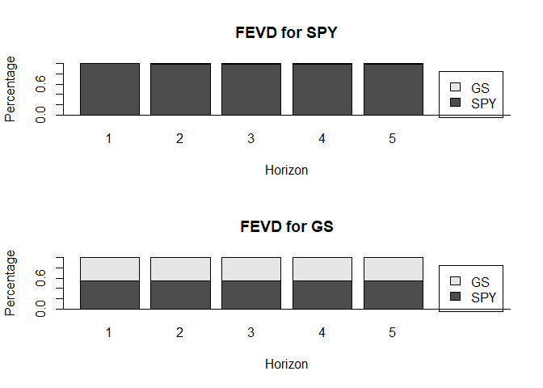
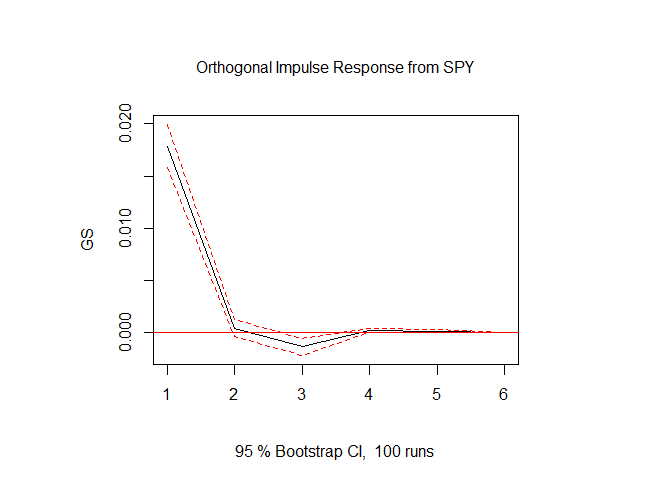
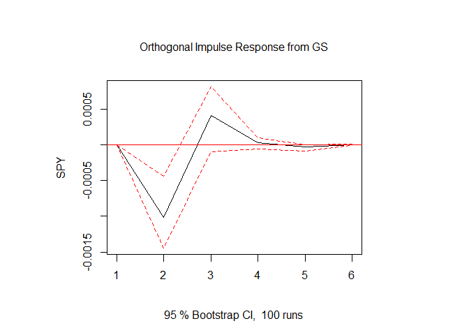

# Basic Time-Series Analysis: The VAR Model Explained?


*This post is the third in a series explaining [Basic Time Series Analysis](http://blog.mindymallory.com/2018/01/basic-time-series-analysis-the-game/). Click the link to check out the first post which focused on stationarity versus non-stationarity, and to find a list of other topics covered. As a reminder, this post is intended to be a very applied example of how use certain tests and models in a time-sereis analysis, either to get someone started learning about time-series techniques or to provide a big-picture perspective to someone taking a formal time-series class where the stats are coming fast and furious. As in the first post, the code producing these examples is provided for those who want to follow along in R. If you aren't into R, just ignore the code blocks and the intuition will follow.* 

In this post I explain how one goes about estimating the relationship among several variables over time. This approach has natural applications in agricultural economics and finance. In ag econ there are commodities whose prices are inherently related because of substitution or complementary effects in production and/or consumption (e.g., corn and soybeans), or because of production processes (e.g., soybeans, soybean oil, and soybean meal). In finance, security prices for companies in a similar sector might be related because of common economic conditions driving profitability (e.g., Bank of America and J.P. Morgan Chase). 


In time-series analysis, there are two basic models typically used to estimate and evaluate the relationships between multiple variables over time.

+ Vector Auto-regression (VAR)
+ Vector Error Correction (VECM)

We will start with the Vector Auto-regression model, because it is the simpler one. The next post will cover VECM which estimates how a group of variables move together in equilibrium. Also for simplicity, we will continue as in the first post using SPY (the S&P 500 exchange traded fund) and GS (Goldman Sachs) prices. 


```r
# If you are following along, uncomment the next lines and run once to install the required packages 
# install.packages('ggplot2')
# install.packages('xts')
# install.packages('quantmod')
# install.packages('broom')
# install.packages('tseries')
# install.packages("kableExtra")
# install.packages("knitr")
# install.packages("vars")

library(quantmod)
getSymbols(c('SPY', 'GS'))
```

```
## [1] "SPY" "GS"
```

```r
SPYRet                <- log(SPY$SPY.Adjusted) - log(lag(SPY$SPY.Adjusted))
GSRet                 <- log(GS$GS.Adjusted) - log(lag(GS$GS.Adjusted))
time_series           <- cbind(SPYRet, GSRet)
colnames(time_series) <- c('SPY', 'GS') 
```


# Vector Autoregression Model 

A VAR model that estimates the relationship between SPY and GS looks like the following. 

\begin{align}
SPY_t &= \beta^{spy}_0 + \beta^{spy}_1SPY_{t-1} + \beta^{spy}_2SPY_{t-2} + \beta^{spy}_3GS_{t-1} + \beta^{spy}_4GS_{t-2} + \nu_{spy} \\
GS_t  &= \beta^{gs}_0  + \beta^{gs}_1SPY_{t-1}  + \beta^{gs}_2SPY_{t-2}  + \beta^{gs}_3GS_{t-1}  + \beta^{gs}_4GS_{t-2}  + \nu_{gs} 
\end{align}

It consists of two linear regression equations, the first explaining the SPY price and the second explaining the GS price. Notice both equations have the exact same explanatory variables. Namely, today's (time *t*) price is explained by yesterdays' SPY price $(SPY_{t-1})$, the day before yesterday's SPY price $(SPY_{t-2})$, yesterday's GS price ($GS_{t-1}$), and the day before yesterday's GS price ($GS_{t-2}$). This is why the VAR is sometimes called a 'reduced form' model. We haven't specified any economic theory about how these equations should be formed. We have simply written them down with exactly equal opportunity for past SPY prices to affect its own and GS prices and for past GS prices to affect its own and and SPY prices. Our estimates of the $\beta$'s might reveal more about the economics. This is in contrast to a 'structural model' where the correct explanatory variables to include on the right hand side would be informed by economic theory. With the VAR, we opt for a fairly general model and let the data do the talking. This approach was perhaps most famously advocated for by Sims(1980), after giving an extensive critique of carefully (mis-)specified macro models of the day. 

## Levels or Returns?

If you read my first post in the series you should be wondering why in the world it is OK to put the SPY and GS prices into the VAR in levels. After all, we found strong evidence that both are non-stationary. This is true, the VAR model written above would have all the problems of a spurious regression we discussed in the first post. Writing the VAR using returns instead of price levels will usually remedy the situation, as noted in the first [post](http://blog.mindymallory.com/2018/01/basic-time-series-analysis-the-game/). 


Then, a VAR(2) using price returns (using the $\Delta$ notation to indicate $\Delta SPY_t = log(SPY_t) - log(SPY_{t-1})$) is

\begin{align}
\Delta SPY_t &= \beta^{spy}_0 + \beta^{spy}_1 \Delta SPY_{t-1} + \beta^{spy}_2 \Delta SPY_{t-2} + \beta^{spy}_3 \Delta GS_{t-1} + \beta^{spy}_4 \Delta GS_{t-2} + \epsilon_{spy} \\
\Delta GS_t  &= \beta^{gs}_0  + \beta^{gs}_1 \Delta SPY_{t-1}  + \beta^{gs}_2 \Delta SPY_{t-2}  + \beta^{gs}_3 \Delta GS_{t-1}  + \beta^{gs}_4 \Delta GS_{t-2}  + \epsilon_{gs} 
\end{align}

Fitting a VAR with two lags to SPY and GS returns yields the following. 

## VAR(2) on SPY and GS Returns


```r
library(vars)
library(stargazer)

var <- VAR(time_series[2:dim(time_series)[1],], p = 2, type = "const", )
stargazer(var$varresult$SPY, var$varresult$GS, type = 'html', dep.var.labels = c("Equation 1-SPY  Equation 2-GS"))
```


<table style="text-align:center"><tr><td colspan="3" style="border-bottom: 1px solid black"></td></tr><tr><td style="text-align:left"></td><td colspan="2"><em>Dependent variable:</em></td></tr>
<tr><td></td><td colspan="2" style="border-bottom: 1px solid black"></td></tr>
<tr><td style="text-align:left"></td><td colspan="2">Equation 1-SPY Equation 2-GS</td></tr>
<tr><td style="text-align:left"></td><td>(1)</td><td>(2)</td></tr>
<tr><td colspan="3" style="border-bottom: 1px solid black"></td></tr><tr><td style="text-align:left">SPY.l1</td><td>0.003</td><td>0.212<sup>***</sup></td></tr>
<tr><td style="text-align:left"></td><td>(0.028)</td><td>(0.054)</td></tr>
<tr><td style="text-align:left"></td><td></td><td></td></tr>
<tr><td style="text-align:left">GS.l1</td><td>-0.062<sup>***</sup></td><td>-0.127<sup>***</sup></td></tr>
<tr><td style="text-align:left"></td><td>(0.014)</td><td>(0.028)</td></tr>
<tr><td style="text-align:left"></td><td></td><td></td></tr>
<tr><td style="text-align:left">SPY.l2</td><td>-0.097<sup>***</sup></td><td>-0.135<sup>**</sup></td></tr>
<tr><td style="text-align:left"></td><td>(0.028)</td><td>(0.054)</td></tr>
<tr><td style="text-align:left"></td><td></td><td></td></tr>
<tr><td style="text-align:left">GS.l2</td><td>0.017</td><td>0.034</td></tr>
<tr><td style="text-align:left"></td><td>(0.014)</td><td>(0.028)</td></tr>
<tr><td style="text-align:left"></td><td></td><td></td></tr>
<tr><td style="text-align:left">const</td><td>0.0004</td><td>0.0001</td></tr>
<tr><td style="text-align:left"></td><td>(0.0002)</td><td>(0.0005)</td></tr>
<tr><td style="text-align:left"></td><td></td><td></td></tr>
<tr><td colspan="3" style="border-bottom: 1px solid black"></td></tr><tr><td style="text-align:left">Observations</td><td>2,791</td><td>2,791</td></tr>
<tr><td style="text-align:left">R<sup>2</sup></td><td>0.021</td><td>0.011</td></tr>
<tr><td style="text-align:left">Adjusted R<sup>2</sup></td><td>0.019</td><td>0.010</td></tr>
<tr><td style="text-align:left">Residual Std. Error (df = 2786)</td><td>0.012</td><td>0.024</td></tr>
<tr><td style="text-align:left">F Statistic (df = 4; 2786)</td><td>14.643<sup>***</sup></td><td>7.909<sup>***</sup></td></tr>
<tr><td colspan="3" style="border-bottom: 1px solid black"></td></tr><tr><td style="text-align:left"><em>Note:</em></td><td colspan="2" style="text-align:right"><sup>*</sup>p<0.1; <sup>**</sup>p<0.05; <sup>***</sup>p<0.01</td></tr>
</table>


In the SPY returns equation (1), the first lag of GS returns and the second lag of SPY returns are statistically significant. Also, in the GS returns equation (2), the first and second lag of SPY returns are statistically significant, and the first lag of GS returns is statistically significant.


## What is it Used for?

The VAR model is used to determine the relationship among several variables. You can use a VAR for forecasting, like we did with the ARIMA and GARCH models, but as we found with those, the forecasts are usually not precise enough to be all that informative from a practical standpoint. Instead, in practice the researcher will usually end up looking at the following three things that are derived from the fitted VAR model: Granger Causality, Impulse Response Functions, and Forecast Error Variance Decomposition, that reveal something about the nature of how these markets move together (or not).  

[Granger Causality](http://www.scholarpedia.org/article/Granger_causality) is most commonly implemented by an F-test on the lags of the other variable on the variables of interest. Stated more simply in our context, it tests whether lags of SPY returns are helpful in forecasting GS returns, and vice versa. Impulse response functions show how one variable might react to sudden changes in the other variable. Finally, forecast error variance decomposition (FEVD) estimates how much of your forecast error can be attributed to unpredictability in each variable in the VAR. 

We will look more closely at each. 

## Granger Causality

Granger Causality is a different kind of causality than one typically runs into in cross-section econometrics, where you might have some kind of natural experiment. A typical story-line of that type might be something like the following: an unpredictable policy change gave a random subset of people more access to credit. An econometrician might then come along and test if greater access to credit leads to X, Y, or Z - like college enrollment, or mechanization on small-holder farms, etc. depending on the context. In that case, the econometrician will try to convince you whether or not access to credit really *caused* the change in outcome. Then, once causality has been established (or not), policy prescriptions might be suggested, perhaps to encourage (or not) the provision of credit. 

In time-series econometrics, we can seldom hope to show 'real' causality. We settle for Granger causality. Are these things correlated enough that one is useful in forecasting the other? If so, Granger Causality can be established. 

The following code takes the VAR regression output object `var`, and tests for Granger causality of SPY returns on GS returns and vice versa. The F-test is done the standard way in the lines where `boot = FALSE`, and using bootstrapped standard errors in the lines where `boot = TRUE`.[^boot] Since we already looked in detail and found heteroskedasticity in these return series in the previous GARCH post, we should be concerned that the standard errors of the F-test calculated in the usual way are too narrow. Note that in the output table below the code that the F-statistics are the same using both methods, but the P-values are bigger using the bootstrap. This is because the bootstrap increases the standard errors according to how bad the heteroskedasticity is. 

[^boot]: A bootstrap is where you do a simulation experiment by randomly drawing a subset of the sample, then calculate the statistic of interest. By doing this a bunch of times you get natural variability in the statistic you care about, which can be used to calculate standard errors of the statistic that are more conservative than the standard method when regression assumptions are not perfectly valid (like having homoskedastic errors). The implementation for many statistics program in the option to 'bootstrap the standard errors'.  

## Tests for Granger Causality


```r
library(broom)
library(knitr)
library(kableExtra)
causeSPY_noboot <- causality(var, cause = 'SPY', boot = FALSE, boot.runs = 5000)$Granger %>% tidy()
causeSPY_boot   <- causality(var, cause = 'SPY', boot = TRUE, boot.runs = 5000)$Granger %>% tidy()
causeGS_noboot  <- causality(var, cause = 'GS', boot = FALSE, boot.runs = 5000)$Granger %>% tidy()
causeGS_boot    <- causality(var, cause = 'GS', boot = TRUE, boot.runs = 5000)$Granger %>% tidy()

causeSPY_noboot$parameter <- NA
causeGS_noboot$parameter  <- NA
causeSPY_boot$df1         <- NA
causeSPY_boot$df2         <- NA
causeGS_boot$df1         <- NA
causeGS_boot$df2         <- NA


resultstable   <- rbind(causeGS_noboot[, c(1, 2, 6, 3, 4, 5)], causeSPY_noboot[, c(1, 2, 6, 3, 4, 5)], causeGS_boot[, c(5, 6, 3, 1, 2, 4)], causeSPY_boot[, c(5, 6, 3, 1, 2, 4)])

resultstable$Bootstrap    <- c('No Bootstrap', '', 'Bootstrap', '')
resultstable   <- resultstable[, c(7, 1, 2, 3, 4, 5, 6)]

colnames(resultstable)    <- c('Bootstrap', 'df1', 'df2', '#Bootstraps', 'Stat', 'P-Value', 'Equation')
  
resultstable %>% 
  kable("html") %>% 
  kable_styling(bootstrap_options = c("striped", "hover"))
```

<table class="table table-striped table-hover" style="margin-left: auto; margin-right: auto;">
 <thead>
  <tr>
   <th style="text-align:left;"> Bootstrap </th>
   <th style="text-align:right;"> df1 </th>
   <th style="text-align:right;"> df2 </th>
   <th style="text-align:right;"> #Bootstraps </th>
   <th style="text-align:right;"> Stat </th>
   <th style="text-align:right;"> P-Value </th>
   <th style="text-align:left;"> Equation </th>
  </tr>
 </thead>
<tbody>
  <tr>
   <td style="text-align:left;"> No Bootstrap </td>
   <td style="text-align:right;"> 2 </td>
   <td style="text-align:right;"> 5572 </td>
   <td style="text-align:right;"> NA </td>
   <td style="text-align:right;"> 10.22703 </td>
   <td style="text-align:right;"> 3.69e-05 </td>
   <td style="text-align:left;"> Granger causality H0: GS do not Granger-cause SPY </td>
  </tr>
  <tr>
   <td style="text-align:left;">  </td>
   <td style="text-align:right;"> 2 </td>
   <td style="text-align:right;"> 5572 </td>
   <td style="text-align:right;"> NA </td>
   <td style="text-align:right;"> 11.43787 </td>
   <td style="text-align:right;"> 1.10e-05 </td>
   <td style="text-align:left;"> Granger causality H0: SPY do not Granger-cause GS </td>
  </tr>
  <tr>
   <td style="text-align:left;"> Bootstrap </td>
   <td style="text-align:right;"> NA </td>
   <td style="text-align:right;"> NA </td>
   <td style="text-align:right;"> 5000 </td>
   <td style="text-align:right;"> 10.22703 </td>
   <td style="text-align:right;"> 7.04e-02 </td>
   <td style="text-align:left;"> Granger causality H0: GS do not Granger-cause SPY </td>
  </tr>
  <tr>
   <td style="text-align:left;">  </td>
   <td style="text-align:right;"> NA </td>
   <td style="text-align:right;"> NA </td>
   <td style="text-align:right;"> 5000 </td>
   <td style="text-align:right;"> 11.43787 </td>
   <td style="text-align:right;"> 8.36e-02 </td>
   <td style="text-align:left;"> Granger causality H0: SPY do not Granger-cause GS </td>
  </tr>
</tbody>
</table>

Without the bootstrapped standard errors we would conclude strongly that SPY Granger causes GS and GS Granger causes SPY. When we use bootstrapped standard errors we fail to reject at a 5% confidence level both that GS returns do not Granger cause SPY returns and that SPY returns do not Granger cause GS returns (so we conclude they do not, but just barely). Or, if you like, you could say that at the 10% confidence level, both SPY returns Granger cause GS returns and GS returns Granger cause SPY returns. Pick you narrative.   


## Forecast Error Variance Decomposition

A [Forecast Error Variance Decomposition](https://en.wikipedia.org/wiki/Variance_decomposition_of_forecast_errors) is another way to evaluate how markets affect each other using the VAR model. In a FEVD, forecast errors are considered for each equation in the fitted VAR model, then the fitted VAR model is used to determine how much of each error realization is coming from unexpected changes (forecast errors) in the other variable. We can calculate this conveniently with `fevd()` from the `vars` package. 


```r
FEVD <- fevd(var, n.ahead = 5)
plot(FEVD)
```

<!-- -->

In the first plot, we see the FEVD for SPY. It appears that although we were borderline on whether or not to conclude that GS returns Granger cause SPY returns, the FEVD reveals that the magnitude of the causality is tiny anyway (we can't even see the contribution from GS returns on the FEVD graph). Conversely, it appears SPY returns account for about half of the forecast error variance in the GS equation. That seems [economically significant](http://marcfbellemare.com/wordpress/11680) to me. 


## Impulse Response Function

[Impluse Response Functions](https://en.wikipedia.org/wiki/Impulse_response) have a similar motivation, but go about it in a little bit different way. In this exercise, you take a shock to one variable, say SPY, and propagate it through the fitted VAR model for a number of periods. You can trace this through the VAR model and see if it impacts the other variables in a statistically significant way. Also from the `vars` package, this is easily achieved with the `irf()` function. Here also confidence intervals are produced by bootstrapping.   


```r
IRF <- irf(var, impulse = 'SPY', response = 'GS',  n.ahead = 5, boot = TRUE, runs = 100, ci = 0.95)
plot(IRF)
```

<!-- -->

```r
IRF <- irf(var, impulse = 'GS', response = 'SPY',  n.ahead = 5, boot = TRUE, runs = 100, ci = 0.95)
plot(IRF)
```

<!-- -->

It appears that a one standard deviation to SPY returns produces a statistically significant response to GS returns for one period, then becomes insignificant. The one standard deviation to GS returns produces a statistically significant response to SPY two periods later (also nearly statistically significant three periods later). Eyeballing the size of these effects, it looks to me like the FEVD and impulse response analysis point to similar findings. The impact of SPY returns on GS returns appears to be sizable in the IRF, while the the impact of GS returns seems to be minimal on SPY returns from an economic impact perspective. 


# That's It! 

That covers the basics of what a VAR model is and how to use Granger causality, FEVD, and impulse response functions to analyze how a group of markets relate to one another. 

There will be just a couple more posts in this series on the basics of time-series analysis. In the next post we will cover cointegration and the VECM. Sometimes, non-stationary variables move so closely together that there is a linear combination of those variables that is stationary! This case requires special consideration. The most intuitive cases are markets that are related by a production process, like the soybean complex. Soybean crushers buy soybeans and sell meal and oil. Economic theory would suggest the prices of those three commodities to maintain a relationship so that the profitability of soybean crushers trends around some modest number greater than zero. 

More details in the next post!  

The final post will summarize the series and provide a 'cook-book' like decision tree on how to decide which model is appropriate for your case. 


# References

Sims, C. A. (1980). Macroeconomics and reality. *Econometrica: Journal of the Econometric Society*, 1-48.


