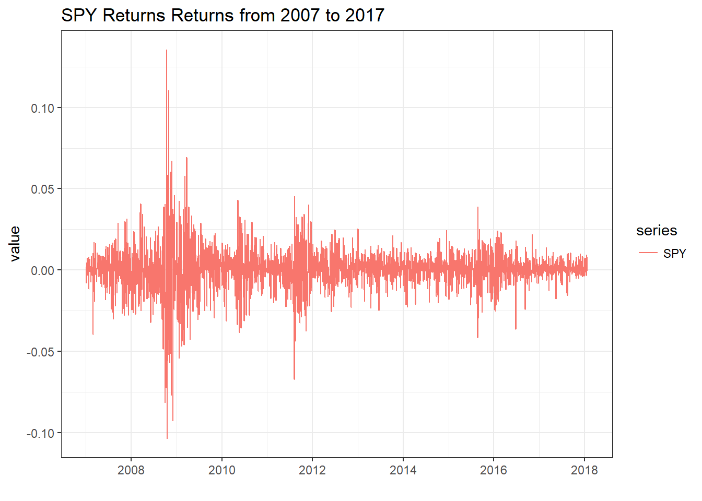
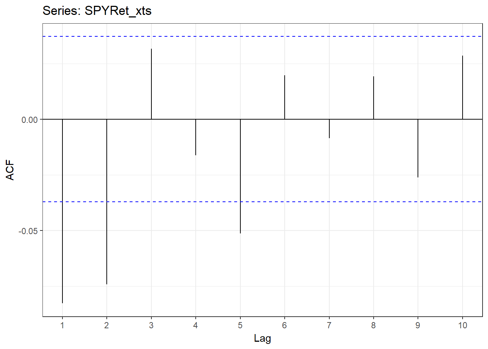
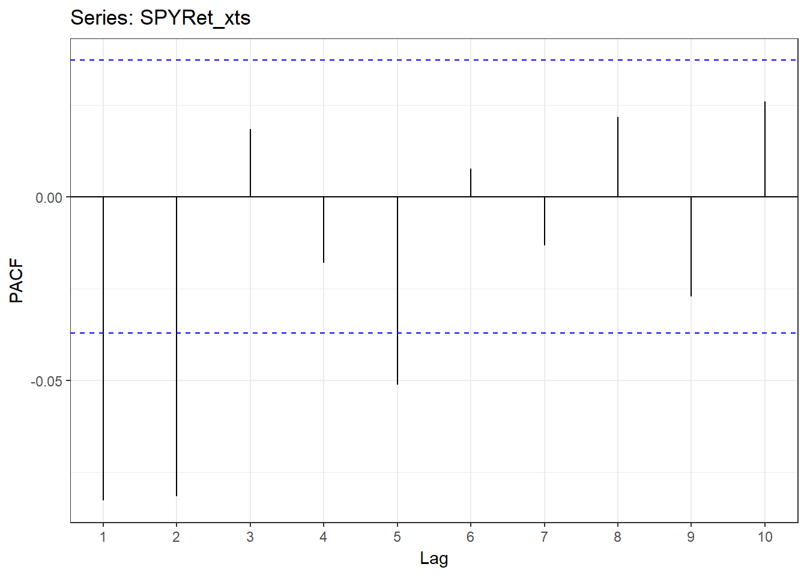

# Basic Time-Series Analysis: Single Equation Models, Fixing the Mean and Variance (ARIMA & GARCH)


*This post is the second in a series explaining [Basic Time Series Analysis](http://blog.mindymallory.com/2018/01/basic-time-series-analysis-the-game/). Click the link to check out the first post which focused on stationarity versus non-stationarity, and to find a list of other topics covered. As a reminder, this post is intended to be a very applied example of how use certain tests and models in a time-sereis analysis, either to get someone started learning about time-series techniques or to provide a big-picture perspective to someone taking a formal time-series class where the stats are coming fast and furious. As in the first post, the code producing these examples is provided for those who want to follow along in R. If you aren't into R, just ignore the code blocks and the intuition will follow.* 

For simplicity, we will continue as in the first post using SPY (the S&P 500 exchange traded fund) prices to illustrate.[^whycomm]

[^whycomm]: If you are wondering why an ag economist like me isn't using commodity prices for my examples, it's because I want to use prices that can be 'pulled' from a data vendor like Yahoo Finance quickly and for free (so spot prices are out), and I don't yet want to introduce the complication of how to create a series of 'nearby' futures contract prices. 

The code below pulls SPY prices from Yahoo Finance, converts them to percent returns, and plots it. In the first post we already determined that SPY has a unit root, so we already know we should generally be working with the data as percent returns.  


```r
# If you are following along in R, uncomment the next lines and run once to install the required packages 
# install.packages('ggplot2')
# install.packages('xts')
# install.packages("stargazer")
# install.packages('quantmod')
# install.packages('broom')
# install.packages('tseries')
# install.packages("kableExtra")
# install.packages("knitr")
# install.packages("forecast")

library(quantmod)
library(broom)
library(ggplot2)
getSymbols(c('SPY'))
```

```
## [1] "SPY"
```

```r
SPY              <- SPY$SPY.Adjusted
SPYRet           <- log(SPY) - log(lag(SPY))
SPYRet_xts       <- SPYRet
colnames(SPYRet) <- c('SPY')
SPYRet           <- tidy(SPYRet)

ggplot(SPYRet, aes(x = index, y = value, color = series)) + 
  geom_line() + 
  theme_bw() +
  labs(title = "SPY Returns Returns from 2007 to 2017", x = "")
```

<!-- -->

Now think about this series in the same context of trying to write down the probability distribution that generate the returns. In the first post of this series, we noted that a proper statistical model should express returns as coming from a single statioanary probability distribution. 

$$r^{SPY}_t \sim N(\mu, \sigma^2)$$

Also in the first post we argued that differencing a non-stationary series usually gets you pretty far toward this goal. This post will continue trying to improve on this objective. Note first that we have not quite acheived a series that follows a single probability distribtion (iid is the stats jargon for this) simply by differencing. It is quite obvious that the volatility of this series changes over time. To correct for changing variance or volalility General Auto-regressive Conditional Heteroskedasticity (GARCH) models can be used. 

Less obvious is that the mean of this series is or might be changing over time. From the plot, you might be able to detect short runs of positive or negative returns. Put another way, although the overal mean looks pretty constant at something near zero, if you focused on a short span of this data, it could have positive or negative returns. Put yet another way, returns could be correlated over time. To correct for a changing mean, or correlation over time in the returns, an ARIMA model can be used. 

We'll discuss both types of models in detail below, but remember this. We know returns are not iid (iid $\rightarrow$ generated by a single probability distribution).

$$r^{SPY}_t \sim N(\mu_t, \sigma_t^2)$$

+ ARIMA corrects for the changing mean $\Rightarrow \mu_t \rightarrow \mu$
+ GARCH corrects for the changing variance $\Rightarrow \sigma^2_t \rightarrow \sigma^2$

# ARIMA 

The ARIMA model is easiest understooby by breaking it down into it's parts. 

## The I Part of ARIMA

Even though the I is in the middle it's the easiest to explain because we've already talked a lot about it. The I stands for Integreted, as in Integrated of order zero, or I(0) (another way to say stationary), or integrated of order one, or I(1) (another way to say non-stationary or unit root). Putting the I in ARIMA simply means we are going to test for unit roots and use log differences if it is non-stationary and levels if it is stationary. We know we should be using log differences for SPY, so we are done with the I part of ARIMA. 

Before we move on, let's note some conventions for writing returns. I see returns often denoted according to this convention where time *t* SPY returns are expressed as

$$\Delta SPY_t = log(SPY_t) - log(SPY_{t-1}),$$ 

and lagged (time *t-1*) returns are expressed as

$$\Delta SPY_{t-1} = log(SPY_{t-1}) - log(SPY_{t-2}),$$ etc.


People are often loose with whether $\Delta SPY_t$ means logged differences (percent returns) or straight differences (without the logs). In price analysis I think it is almost always preferable to deal with percent changes, so you will mostly see logged differences. Also fairly common is notation like

$$r^{SPY}_t = log(SPY_t) - log(SPY_{t-1}),$$

to more explicitly state that logged differences are being used to create percent returns. This is the convention we're using in the current post. 


## The AR Part of ARIMA

We said that the ARIMA model will ultimately help us eliminate the correlation accross time of the returns. Usually if you are worried about this you will check to see if there actually is autocorrelation in your data before deciding on the ARIMA model. To check this, the autocorrelation function (ACF), and partial autocorrelation function (PACF) are used. 

## ACF(h)

The autocorrelation function of h, ACF(h), is the correlation between $r^{SPY}_t$ and $r^{SPY}_{t-h}$. So ACF(1) is $Corr(r^{SPY}_t, r^{SPY}_{t-1})$, ACF(2) is $Corr(r^{SPY}_t, r^{SPY}_{t-1})$, etc. 

In R, the ACf() function from the forecast package computes these for as many lags (h's) as you want and plots them. It's a quick way to know if your data have autocorrelation problems to be fixed. 


```r
library(forecast)
ggAcf(SPYRet_xts, lag.max = 10) + theme_bw()
```

<!-- -->

The horozonal lines on this chart are the significance lines. So the spikes above or below the blue lines indicate significant autocorrelation of current returns with that lag of returns. So it looks like there is indeed autocorrelation to account for in SPY returns. 

## PACF

The partial autocorrelation function tells you how much correlation there is between current returns and a lagged return after removing the correlation from all the previous. Its kind of like isolating which lags are really driving autocorrelation and which are just propogating the effects through the system. 

There is a similar function in R to calculate the PACF() funciton. 


```r
ggPacf(SPYRet_xts, lag.max = 10) + theme_bw()
```

<!-- -->

Since this function is more focused on isolating which lags are important it can be used to inform how many lagged returns should be included in a model to explain returns. In this case you would definitely include at least two, and possibly up to five lags. The fifth lag is a judgement call because at some level it is hard to believe returns from five days ago will be useful in predicting or explaining current returns. And, you give up degrees of freedom and power the more regressors you put in the model. Although in this particular case we have a lot of data in our series, it wouldn't matter too much.


## The AR(p) Model

An autoregressive model of order p, AR(p) just means that we are going to try to explain SPY returns with p lags of of SPY returns. An AR(2) model for SPY returns looks like the following: 


\begin{align}
r^{SPY}_t &= \beta_0 + \beta_1r^{SPY}_{t-1} + \beta_2r^{SPY}_{t-2} + \epsilon_t \\
\end{align}


```r
SPYRet_xts1   <- lag(SPYRet_xts)
SPYRet_xts2   <- lag(SPYRet_xts1)
AR2           <- lm(SPYRet_xts ~  SPYRet_xts1 + SPYRet_xts2)
```

```r
tidy(AR2)
```

         term      estimate    std.error statistic      p.value
1 (Intercept)  0.0003819429 0.0002371663  1.610444 1.074149e-01
2 SPYRet_xts1 -0.0894985039 0.0189258301 -4.728908 2.370185e-06
3 SPYRet_xts2 -0.0817689778 0.0189243518 -4.320834 1.609093e-05
