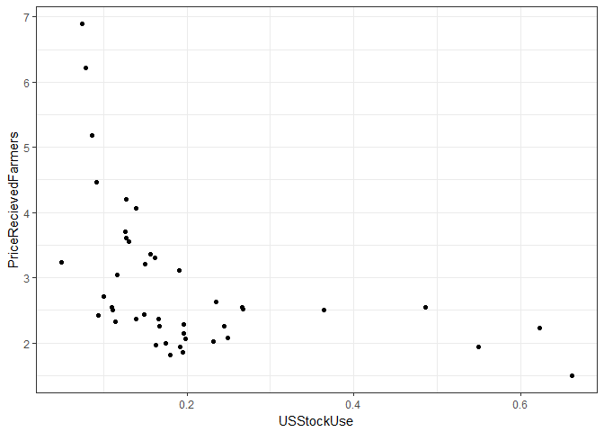
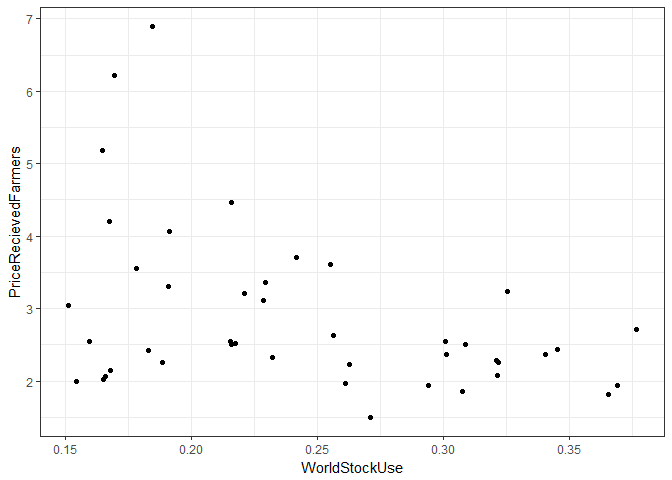

# Machine Learning and Econometrics: Flexibilty versus Interpretability


*This is the second in a series of posts where I document my own process in figuring out how machine learning relates to the classic econometrics one learns in a graduate program in economics. Note that I am a B+ practitioner of applied econometrics, so the ideas I am working through are not new, or may not even be fully accurate. But, I think many of us applied economists are starting to learn and dabble in this area and I thought it might be fruitful to learn publicly in these blog posts.* 

I had at least three people reach out after my first machine learning post saying that they are starting to use these methods in their own research, and one former classmate in the corporate world who reached out to say these methods are already deeply embeded in their business. It feels like this is a really great time to sort these things out. 

# Flexibility versus Interpretability

I started going through [An Introduction to Statistical Learning](http://www-bcf.usc.edu/~gareth/ISL/index.html), and the first thing that struck me is that linear regression gets two whole chapters devoted to it (Chapters 3 and 6). I was a bit surprised because my niave view was that linear regression was something primitive and completely separate from the concepts of machine learning, wheras in this book, linear regression is presented as a baseline or starting place for the concepts of machine learning. This left me with a question. Why is econometrics as usually presented as something separate methodologically from machine learning? 

In chapter 2, I think I got the answer to my question. The authors note that there is always a tension between flexibility and interpretability of a model. Linear regression is quite inflexible, but it is readily interpretable. Non-linear models can be quite complex in how an independent variable is functionally related to the dependent variable. In economics, we care about interpretability. We go through great pains to find instruments, design experiments, get random samples, in order to argue causaility of one variable on another. Inference and interpretability matter a great deal to us, so inflexible models are often attractive for this purpose. Additionally, less flexible models often perform fairly well compared to more flexible models in terms of predictive accuracy, at least in out of sample testing, due to overfitting in flexible models. So you get a lot of milage out of an inflexible model like linear regression, and more flexible models might not perform much better on meduim data anyway. 

Our analysis is often naturally constrained in terms of the number of independent variables one might include. First, economic theory often suggests what things might be important independent variables, so there is less need to throw everything into a regression and see if it predicts. Or, you might be constrained by the scarcity of relevent data. If you conduct a survey, you can only ask so many questions and then you only have that many potential independent varaibles. To use a concept from my first machine learning post, we often have 'medium data' not big data. 

So I think there are good reasons why econometrics has gravatated to linear regression models.

+ We care very much about inference, less emphasis on prediction $\Rightarrow$ Linear regression often works well
+ We often have medium data $\Rightarrow$ Linear regression often works well. 

So does that mean we should scoff at this machine learning stuff? No I don't think so. Reading into chapter 5 (Resampling Methods) and chapter 6 (Linear Model Selection and Regularization), I think there are really nice opportunities to get a lot of benefit even in a linear model and even with medium data. Chapter 5 covers resampling methods including Cross-Validation and Bootstrap methods. Bootstrap is ubiquitous in econometrics, but cross-validation could be successfully utilized more, I think. Among those of us working with large 'medium data', like the Census or Ag Census, the methods are chapter 6 are fairly commonly employed, I think. 

I'll explore a concept called cross validation a little more in the remainder of this post. 


# Bias-Variance Tradeoff

Another key is to understand the bias-variance tradeoff in building a model. If you have a model, $y = f(x) + \epsilon$, so that $y$ is a function of $f$ plus some noise. Then, if we want to find out about how $x$ affects $y$, or use known values of $x$ to predict $y$, we need to find a function $\hat{f}(x)$ that is as close as possible to $f$. The most common way to assess if our $\hat{f}$ is good or not is with mean squared error (MSE), or root mean squared error where we take the square root of the MSE. MSE is defined like this. 

$$MSE = \frac{1}{n}\sum_{i=1}^n (y_i - \hat{f}(x_i))^2 $$

It justs takes all the model's predictions, $\hat{f}(x_i)$, calculates the square of how far they are from the actual value, $y_i$, and averages that. So a low MSE is good - your predictions were not far away from the acutal values. 

So what contribues to a model's errors? Head over to [Wikipedia](https://en.wikipedia.org/wiki/Bias%E2%80%93variance_tradeoff) for a proof, but for any particular observation, 

$$E(y_i - \hat{f}x_i)^2 = Var(\hat{f}(x_i)) + Bias(\hat{f}(x_i))^2 + Var(\epsilon_i),$$

where, $Bias(\hat{f}(x_i)) = E(\hat{f}(x_i) - f(x_i))$. Clearly to get a low MSE you need a model that will give you low variance and low bias. But, typically these things move in opposite directions. You get a high variance in $\hat{f}$ with a more flexible model because when a model is flexible (think for example of a high degree polinomial versus a linear model where the polynomal has many more parameters to estimate) different training data sets will make the fitted function 'wiggle' around much more than the linear model. Conversely, models that are less flexible have higher bias, because it can not accomodate the true shape of the data generating process as easily as a more flexible model. 

In ISL, figure 2.11 illustrates this very well. 


*This figure is taken from "An Introduction to Statistical Learning, with applications in R"  (Springer, 2013) with permission from the authors: G. James, D. Witten,  T. Hastie and R. Tibshirani*

Here you see a scatterplot of a data set with varaibles X and Y as circles in the left panel. To model the data they fit a linear model (in gold), and increasingly higher degree polinomials in black, blue, and green. Of course, the higher the degree of the polynomial the more 'wiggly' the $\hat{f}$. Then in the right panel, they plot the MSE of these different candiate $\hat{f}$'s. The training set MSE is in grey and the test set (out of sample in the parlance of price forecasting) MSE is in red. 

This illustrates an important point. Yes, variance and bias of a model move in opposite directions, but not nessessarily at the same rate (as flexibility increases I mean). Here, when you move from a linear, to a 3rd degree, to a 5th degree polynomial, you get dramatic reductions in the MSE of both the training set and the test set. 

This is because the reduction in bias overwhelms the increase in variance. Though, after about a 5th degree polynomial, the gains dissapear and you do not get much more out of adding higher polynomial terms to the $\hat{f}$. 

The approach of using MSE for model selection seems to be pretty ubiquitous in machine learning contexts. In economics, it is commonly used to select among competing forecasting models, but I don't think it is used that widely in models where inference is the goal. 


# Cross Validation

Cross validation is a technique for model selection that I do not believe is widely used by economists, but I think it has a lot of promise. It does not seem to me to require a particularly large data set, so it could be an effective tool even on our 'medium' data sets. 

The idea behind it is pretty simple. In model selection, you will have a number of candidate models. Conceptually, the example above is pretty simple, your candidate models are different degree polynomials. But, you could have a number of candidate models that look very different from one another. The MSE approach to model selection is to just see which one predicts the best on a 'hold out' data set. That is basically what we did in the example shown in figure 2.11. 

Cross Validation just takes this one step further. In k-Fold cross validation you do the MSE exercise with k different (non-overlapping) hold out samples. An illustration for a 5-Fold cross validation sample split is shown in figure 5.5 from the ISL book. 

 


*This figure is taken from "An Introduction to Statistical Learning, with applications in R"  (Springer, 2013) with permission from the authors: G. James, D. Witten,  T. Hastie and R. Tibshirani*


# An Ag Example

Ending Stocks. U.S. Million bushels. Row, 1000 MT. 


```r
# install.packages('tibble')
library(tibble)
library(dplyr)
library(tidyr)
library(ggplot2)
stocks  <- read.csv('images/stocks.csv')
stocks  <- as_tibble(stocks)
stocks  <- mutate(stocks, USStockUse = USEndingStocks/USTotalUse, WorldStockUse = ROWEndingStocks/WorldTotalUse)

us      <- ggplot(stocks, aes(x = USStockUse, y = PriceRecievedFarmers)) + geom_point() + theme_bw()
us
```

<!-- -->

```r
ROW      <- ggplot(stocks, aes(x = WorldStockUse, y = PriceRecievedFarmers)) + geom_point() + theme_bw()
ROW
```

<!-- -->


The advantage of this is that it allows the variance and bias of the fitted models to be revealed a little more completely. By using different subsets of your data as the test set you get a sense of how much individual observations are moving around your MSE estimates. When conducting a k-Fold cross validation, you typically just average the MSE's given by each of the k model estimates. 
